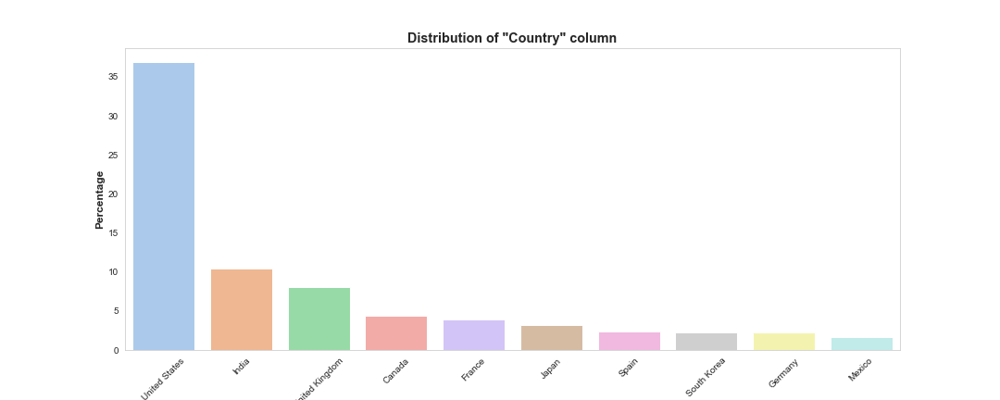

# netflix_movie_tv_show_EDA_DS005
## Analysis of the netflix movies &amp; tv shows dataset (EDA)

---

## Introduction   
#### Context  
Netflix is one of the biggest streaming movies & tv shows platform. They have variety of genres and provide us a lot of movies or tv shows from around the world. Finding some insights in the datasets of movies & tv shows attributes produced by Netflix would be beneficial for stakeholders related to streaming or entertainment industry.  
#### Need  
Finding insights through visualizations in the dataset.  
#### Outcome  
Visualization makes us easiear & faster to take new information & patterns from the dataset.  
#### Vision  
Information & patterns hopefully will make decisions from stakeholders in the related industry more data-driven.

---

The dataset = [Netflix Movies and TV Shows](https://www.kaggle.com/datasets/shivamb/netflix-shows)  
The final analysis = [Jupyter notebook file](https://github.com/IchfanKurniawan/netflix_movie_tv_show_EDA_DS005/blob/main/netflix_data_eda.ipynb)  

#### Key Findings  
- Almost 70% of netflix contents is movies & the rest are tv shows  

  

  

- Here are the top 10 countries

  

  

- Here are the top 10 countries divided by "type" (movies & tv shows).  
Countries which has big portion of movies than tv shows= USA, Canada, India.  
Countries which has big portion of tv shows than movies= India, Japan, South Korea.  

  

  

- The release year reachs its peak in 2018 and then gradually down.

  
  

  

- The release year of movies reachs its peak in 2018 and then gradually down. However, the release year of tv shows reachs its peak in 2020.

  
  

  

- There is no pattern in the release month

  

  

- Mostly the contents (movies or tv shows) are released in the first day a month or in the middle of a month.

  
  

  

- Mostly movies have duration in range 90-150 min.

  

  

- Mostly tv shows have duration of 1 season.

  

  

- The director in the dataset is quite diverse as shown by the lower value of percentage.

  

  

- The cast in the dataset is quite diverse as shown by the lower value of percentage.

  

  

- Mostly the contents have TV-MA rating.

  

  

- The cast in the dataset is quite diverse as shown by the lower value of percentage.

  

  

- Top 3 listed_in column values= international movies, drama, comedy

  

  
